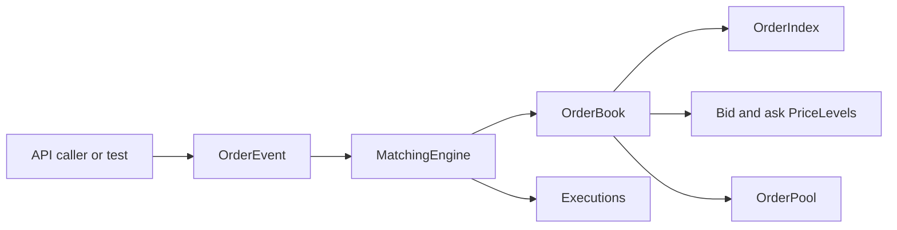
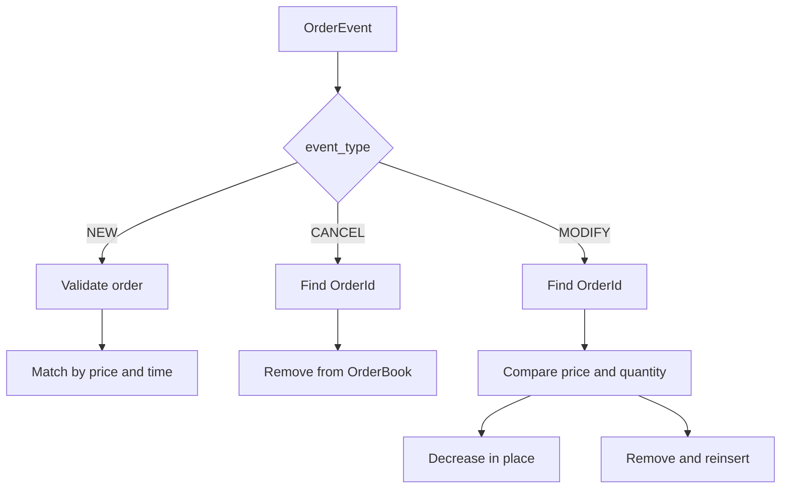
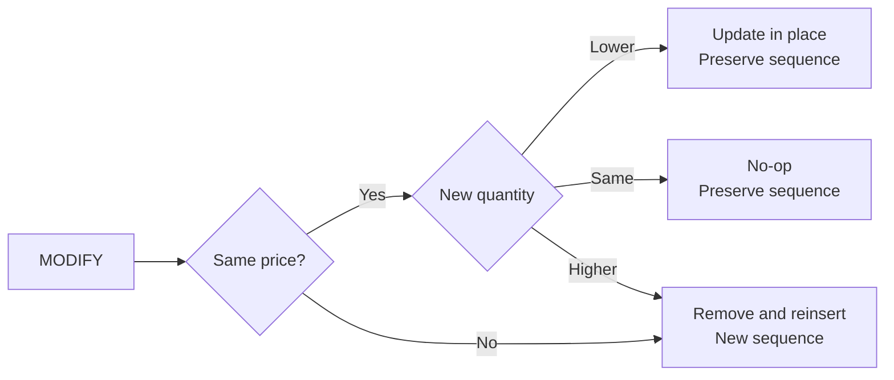
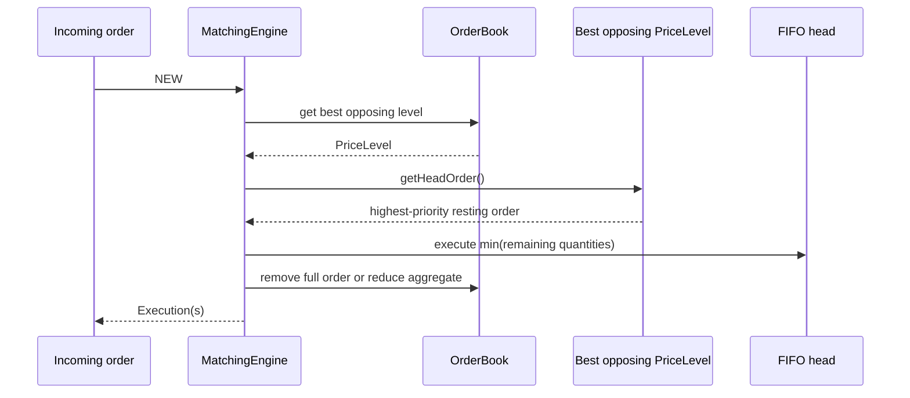

# Leka - Low-Latency Limit Order Book and Matching Engine

Leka is a C++20 limit order book and matching engine for exploring the systems
engineering problems behind electronic trading: price-time priority,
deterministic matching, stable object lifetimes, cancellation, allocation
behavior, and measurable workloads.

The current implementation is a single-instrument core engine. Application,
HTTP, JSON, WebSocket, database, and frontend concerns are intentionally
outside the core library.



The core path is deliberately small: callers submit typed events, the
matching engine makes execution decisions, and the order book owns the
resting state and its indexes.

## Current capabilities

The implemented core supports:

- `LIMIT` and `MARKET` orders
- `BUY` and `SELL` sides
- Price-time FIFO matching
- Full and partial executions
- Limit-order remainders
- Market orders that never rest
- Cancellation by `OrderId`
- Event-first `NEW`, `CANCEL`, and `MODIFY` dispatch
- Deterministic sequence numbers
- Average O(1) order-ID lookup
- Intrusive O(1) removal of a known order from a price level
- Stable order addresses while orders are alive
- Page-based pooled order storage
- Integer-based price and quantity values
- AddressSanitizer and UBSan build configuration

## Event-first dispatch

`OrderEvent` selects the operation before the matching engine interprets the
rest of the payload. This keeps fields for one operation from being confused
with fields for another operation.



The operation is selected before its payload is interpreted. A `CANCEL` does
not need side, type, price, or quantity, while `NEW` does.

The event-oriented entry points are:

```cpp
engine.processEvent(OrderEvent{NewOrder{
		orderId, price, quantity, timestamp, side, orderType
}});

engine.processEvent(OrderEvent{CancelOrder{orderId}});

engine.processEvent(OrderEvent{ModifyOrder{
		orderId, newPrice, newQuantity
}});
```

`processOrder(const OrderEvent&)` is also available as an alias. `NEW` events
return executions. `CANCEL` and `MODIFY` events return an empty execution list.

### NEW

The `NEW` payload contains:

- `OrderId`
- `Price`
- `Quantity`
- `Timestamp`
- `OrderSide`
- `OrderType`

For a limit order, the engine matches crossing liquidity and rests any
remaining quantity. A market order consumes available opposing liquidity and
discards any unfilled remainder.

### CANCEL

The `CANCEL` payload contains only an `OrderId`. It does not interpret side,
order type, price, or quantity. Cancellation uses the order index, unlinks the
order from its price-level FIFO, removes the index entry, and releases the
pooled order storage.

### MODIFY

The `MODIFY` payload contains:

- `OrderId`
- `newPrice`
- `newQuantity`

Modification applies to an existing resting limit order. The engine compares
the requested values with the current order before deciding whether the order
can remain in place or must be requeued.

## Leka V1 priority semantics

**Leka V1 uses Nasdaq-style price/time modification semantics for ordinary
displayed limit orders.** Exact rules vary by venue; this is the explicit
policy implemented by Leka V1.

| Modification | Priority | Current behavior |
| --- | --- | --- |
| Decrease quantity at the same price | Preserved | Update the order in place and reduce the price-level aggregate. |
| Increase quantity | Reset | Remove and reinsert at the FIFO tail with a new sequence number. |
| Change price | Reset | Move to the new price level and assign a new sequence number. |
| Change price and quantity | Reset | Reinsert using the new price and quantity. |
| No effective change | Preserved | Treat the event as a no-op. |

For a partially executed order, `newQuantity` refers to its current remaining
quantity. A priority-reset modification recreates the resting representation
with the requested quantity.



## Matching behavior

Bids and asks are stored in ordered maps:

```text
Bids: std::map<Price, PriceLevel>
Asks: std::map<Price, PriceLevel>
```

The best bid is the highest bid and the best ask is the lowest ask:

```text
Best bid -> bids.rbegin()
Best ask -> asks.begin()
```

A buy limit order crosses when its price is greater than or equal to the best
ask. A sell limit order crosses when its price is less than or equal to the
best bid. Each execution uses:

```text
execution quantity = min(incoming remaining, resting remaining)
execution price    = resting order price
```

At one price, orders are held in an intrusive FIFO queue. Partial execution
reduces only `remainingQuantity`; a partially filled order stays at the front
of its price level.



## Core data structures

### Price levels

Each `PriceLevel` stores a head and tail pointer, order count, and aggregate
remaining quantity. The intrusive links provide insertion at the tail and
removal of a known order without allocating a separate list node.

### Order index

`OrderIndex` stores:

```cpp
std::unordered_map<OrderId, Order*>
```

This gives average O(1) lookup for cancellation and modification. The index,
price-level queues, and order pool are updated together by `OrderBook`.

### Order pool

`OrderPool` allocates orders from fixed 64 KiB pages. Live orders keep stable
addresses, released slots can be reused, and pages remain owned by the pool
until the pool is destroyed.

### Price and quantity

`Price` and `Quantity` are integer wrapper types. This gives deterministic
ordering and equality behavior without floating-point comparisons. The current
generic `Price` type does not define a decimal scaling convention or instrument
tick-size rules; those remain future market-configuration concerns.

## Sequence numbers

The matching engine uses a monotonically increasing `SequenceNumberGenerator`
to record deterministic engine processing order. Sequence numbers support
price-time ordering, replay-oriented determinism, debugging, and tests.

Accepted `NEW` orders receive a sequence number even when they are fully
executed or are market orders that do not rest. Valid cancellation events do
not allocate a new sequence number. A priority-reset modification receives a
new sequence number; a quantity decrease and no-op modification retain the
existing sequence number.

Invalid `NEW` inputs and duplicate order IDs are rejected before allocating a
sequence number. Sequence behavior for invalid `MODIFY` input remains an area
for hardening before this engine is used as a production component.

## Current project structure

```text
include/lob/
	book/       OrderBook, PriceLevel, OrderPool
	index/      OrderIndex
	matching/   MatchingEngine, Execution, sequence generator
	order/      Order, sides, types, OrderEvent
	types/      OrderId, Price, Quantity, Timestamp, SequenceNumber
src/
	book/ index/ matching/ order/
tests/unit/
benchmarks/
cmake/
```

The repository also contains placeholder directories and files for future
market-data, application, UI, integration-test, stress-test, and workload
generation work. They are not part of the current CMake build.

## Testing status

The current CMake configuration builds and registers two test executables:

- `test_order_book`
- `test_matching_engine`

The tests cover empty and non-empty books, crossing and non-crossing limit
orders, market orders, full and partial executions, FIFO behavior, remainders,
duplicate IDs, invalid market prices, cancellation, pool slot reuse, sequence
monotonicity, and event-based cancel/modify priority behavior.

Integration and randomized stress test files exist as placeholders but are not
currently implemented or registered with CTest. GoogleTest is not currently a
project dependency; the existing tests use standard C++ assertions.

## Benchmarking status

The current benchmark executable runs a 100,000-iteration add/cancel workload
and reports total nanoseconds and average nanoseconds per order. It does not
currently report p50, p95, p99, or p99.9 latency distributions.

Performance work should follow:

```text
Correctness -> baseline -> measure -> profile -> optimize -> measure again
```

The current benchmark is an early local baseline, not a portable performance
claim. Results depend on hardware, compiler, build flags, and system load.

## Sanitizers

When `ENABLE_SANITIZERS=ON`, the CMake configuration enables AddressSanitizer
and UndefinedBehaviorSanitizer for the core library, tests, and benchmark
target on Clang and GCC-compatible toolchains.

## Build and test

Requirements:

- C++20 compiler
- CMake 3.20 or newer

Build and run the current tests:

```sh
cmake -S . -B build
cmake --build build
ctest --test-dir build --output-on-failure
```

Build with sanitizers:

```sh
cmake -S . -B build-sanitize -DENABLE_SANITIZERS=ON
cmake --build build-sanitize
ctest --test-dir build-sanitize --output-on-failure
```

Run the benchmark:

```sh
./build/benchmark_order_book
```

## Planned work

The following items are planned rather than implemented in the current core:

- Integration and randomized stress testing
- Mixed-operation and million-operation benchmarks
- Latency percentile reporting
- CPU and hot-path profiling
- Time-in-force semantics
- Multiple instruments
- Market-data adapters and historical replay
- Databento MBO integration
- Synthetic stochastic order-flow generation
- Calibration against real market microstructure
- CLI, server, and UI integration

An MBO adapter should remain separate from the internal order-event interface:
an exchange `ADD`, `CANCEL`, `MODIFY`, `TRADE`, or `CLEAR` message describes
observed market data and should not automatically be treated as a customer
order submitted directly to this matching engine.

## Design principles

1. Correctness before performance.
2. Measure before optimizing.
3. Predictability matters alongside average throughput.
4. Data structures should reflect the workload.
5. Memory behavior is part of performance.
6. Ownership and object lifetime should be explicit.
7. Venue-specific behavior should be documented rather than implied.
8. The matching engine should remain independent of application infrastructure.
