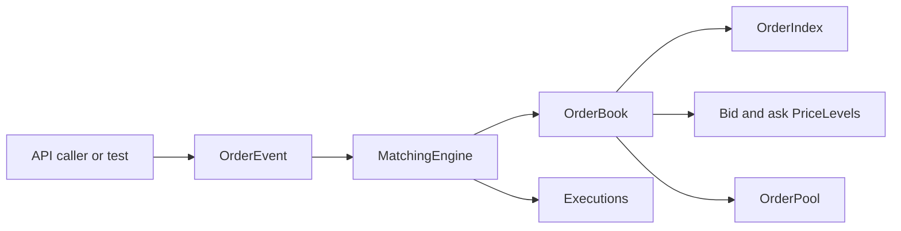
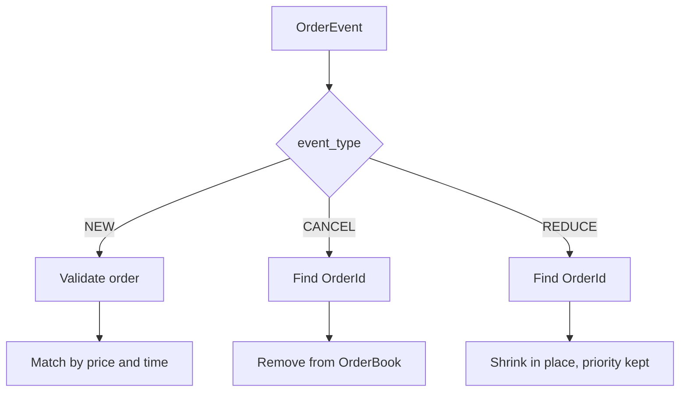
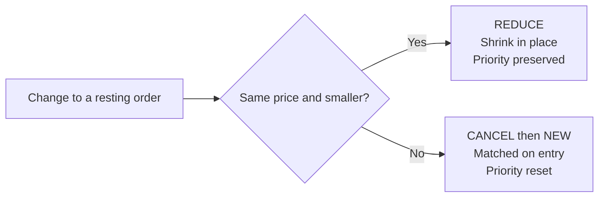
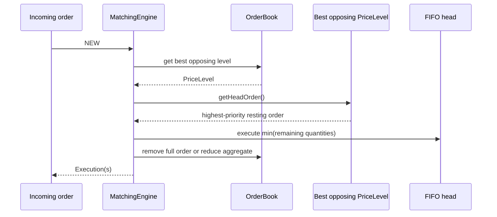

# Leka - Low-Latency Limit Order Book and Matching Engine

Leka is a C++20 limit order book and matching engine for exploring the systems
engineering problems behind electronic trading: price-time priority,
deterministic matching, stable object lifetimes, cancellation, allocation
behavior, and measurable workloads.

The current implementation is a single-instrument core engine. Application,
HTTP, JSON, WebSocket, database, and frontend concerns are intentionally
outside the core library.

**[▶ Open the live replay viewer](https://danielesambu.com/leka/viz/)** —
recorded Nasdaq BX sessions for three symbols (AAPL, INTC, MSFT), each next to
two fitted synthetic models (Poisson/CSTT baseline, Hawkes self-exciting), all
replayed through this engine: price, market depth, the order book, engine
latency percentiles, and the trade tape. The snapshots are regenerated by CI
on every push, so what you see always matches the engine that produced it.

See [ARCH_DECISIONS.md](ARCH_DECISIONS.md) for the hot-path design decisions —
the event model's move away from an in-place `MODIFY`, the tick-indexed
`PriceLadder` that replaced `std::map<Price, PriceLevel>`, and the measured
before/after latency for both — with the reasoning and the numbers behind
each.



The core path is deliberately small: callers submit typed events, the
matching engine makes execution decisions, and the order book owns the
resting state and its indexes.

## Current capabilities

The implemented core supports:

- `LIMIT` and `MARKET` orders
- `BUY` and `SELL` sides
- Price-time FIFO matching
- Full and partial executions
- Limit-order remainders
- Market orders that never rest
- Cancellation by `OrderId`
- Event-first `NEW`, `CANCEL`, and `REDUCE` dispatch
- Deterministic sequence numbers
- Average O(1) order-ID lookup
- Intrusive O(1) removal of a known order from a price level
- Stable order addresses while orders are alive
- Page-based pooled order storage
- Integer-based price and quantity values
- AddressSanitizer and UBSan build configuration

## Event-first dispatch

`OrderEvent` selects the operation before the matching engine interprets the
rest of the payload. This keeps fields for one operation from being confused
with fields for another operation.



The operation is selected before its payload is interpreted. A `CANCEL` does
not need side, type, price, or quantity, while `NEW` does.

The event-oriented entry points are:

```cpp
engine.processEvent(OrderEvent{NewOrder{
		orderId, price, quantity, timestamp, side, orderType
}});

engine.processEvent(OrderEvent{CancelOrder{orderId}});

engine.processEvent(OrderEvent{ReduceOrder{orderId, newQuantity}});
```

`processOrder(const OrderEvent&)` is also available as an alias. `NEW` events
return executions. `CANCEL` and `REDUCE` events return an empty execution list.

There is no in-place modify. On a price-time-priority venue a reprice or a
size increase always forfeits queue position, so it is submitted as a `CANCEL`
followed by a `NEW`. That also routes the replacement through the matcher, so
repricing an order through the opposite side trades instead of leaving the
book crossed. `REDUCE` is the only change that preserves time priority.

### NEW

The `NEW` payload contains:

- `OrderId`
- `Price`
- `Quantity`
- `Timestamp`
- `OrderSide`
- `OrderType`

For a limit order, the engine matches crossing liquidity and rests any
remaining quantity. A market order consumes available opposing liquidity and
discards any unfilled remainder.

### CANCEL

The `CANCEL` payload contains only an `OrderId`. It does not interpret side,
order type, price, or quantity. Cancellation uses the order index, unlinks the
order from its price-level FIFO, removes the index entry, and releases the
pooled order storage.

### REDUCE

The `REDUCE` payload contains:

- `OrderId`
- `newQuantity`

Reduction shrinks a resting limit order in place. The price cannot change, so
the order never moves between levels: it keeps its FIFO position, its sequence
number, and its timestamp, and only the order's remaining quantity and the
price-level aggregate are updated. An absent `OrderId` is a no-op rather than
an error, because a replayed feed may reference an order that was already
resting before the captured window began.

## Leka V1 priority semantics

**Leka V1 uses Nasdaq-style price/time priority for ordinary displayed limit
orders.** Exact rules vary by venue; this is the explicit policy implemented
by Leka V1.

| Change | Priority | How it is expressed |
| --- | --- | --- |
| Decrease quantity at the same price | Preserved | `REDUCE`, updated in place. |
| Increase quantity | Reset | `CANCEL` then `NEW`, joining the FIFO tail. |
| Change price | Reset | `CANCEL` then `NEW`, matched on entry. |
| Change price and quantity | Reset | `CANCEL` then `NEW`. |
| No effective change | Preserved | `REDUCE` to the current quantity is a no-op. |

Encoding priority-resetting changes as two events is what the venue itself
does. Nasdaq TotalView-ITCH has no in-place modify: an `X` message shrinks an
order and keeps its priority, while a `U` replace retires the original
`order_ref` and issues a new one at the back of the queue. Leka's `REDUCE` and
`CANCEL`+`NEW` map onto those one-for-one.

For a partially executed order, `newQuantity` refers to its current remaining
quantity.



## Matching behavior

Bids and asks are tick-indexed arrays (`PriceLadder`), not ordered maps — a
price is an array index, not a search key:

```text
index = (price - minPrice) / tickSize
```

Each side is indexed so that the best price is always the *lowest occupied
index*: ascending for asks, descending for bids. Occupancy lives in a bitset,
and the best index is cached, so best-of-book is an array read rather than a
tree descent. See [ARCH_DECISIONS.md](ARCH_DECISIONS.md) ADR-002 for the
measured 2.1x this bought, and the bounded-price-range tradeoff it costs.

A buy limit order crosses when its price is greater than or equal to the best
ask. A sell limit order crosses when its price is less than or equal to the
best bid. Each execution uses:

```text
execution quantity = min(incoming remaining, resting remaining)
execution price    = resting order price
```

At one price, orders are held in an intrusive FIFO queue. Partial execution
reduces only `remainingQuantity`; a partially filled order stays at the front
of its price level.



## Core data structures

### Price levels

Each `PriceLevel` stores a head and tail pointer, order count, and aggregate
remaining quantity. The intrusive links provide insertion at the tail and
removal of a known order without allocating a separate list node.

### Order index

`OrderIndex` is a hand-rolled open-addressed hash table (linear probing,
backward-shift deletion, `OrderId{0}`'s reserved-invalid status doubling as
the empty-slot sentinel) mapping `OrderId -> Order*` in one contiguous
`std::vector<Slot>`, not `std::unordered_map`. See
[ARCH_DECISIONS.md](ARCH_DECISIONS.md) (ADR-006) for why: this lookup runs on
every `NEW`, `CANCEL`, `REDUCE`, and fill, so it is the hottest lookup in the
engine, and a chained hash table pays a per-entry node allocation and a
pointer chase that a flat probe sequence does not.

This gives average O(1) lookup for cancellation and reduction. The index,
price-level queues, and order pool are updated together by `OrderBook`.

### Order pool

`OrderPool` allocates orders from fixed 64 KiB pages. Live orders keep stable
addresses, released slots can be reused, and pages remain owned by the pool
until the pool is destroyed.

### Price and quantity

`Price` and `Quantity` are integer wrapper types. This gives deterministic
ordering and equality behavior without floating-point comparisons. The current
generic `Price` type does not define a decimal scaling convention or instrument
tick-size rules; those remain future market-configuration concerns.

## Sequence numbers

The matching engine uses a monotonically increasing `SequenceNumberGenerator`
to record deterministic engine processing order. Sequence numbers support
price-time ordering, replay-oriented determinism, debugging, and tests.

Accepted `NEW` orders receive a sequence number even when they are fully
executed or are market orders that do not rest. `NEW` is the only event that
allocates one: `CANCEL` and `REDUCE` cannot change an order's queue position,
so there is nothing for a new sequence number to express. A priority-resetting
change is a `CANCEL` followed by a `NEW`, and the sequence number comes from
that `NEW`.

Invalid `NEW` inputs and duplicate order IDs are rejected before allocating a
sequence number.

## Current project structure

```text
include/lob/
	book/         OrderBook, PriceLadder, PriceLevel, OrderPool
	concurrency/  SpscEventQueue (feed-handler / matching-thread handoff)
	index/        OrderIndex (open-addressed, backward-shift deletion)
	matching/     MatchingEngine, Execution, sequence generator
	order/        Order, sides, types, OrderEvent
	types/        OrderId, Price, Quantity, Timestamp, SequenceNumber
src/
	book/ concurrency/ index/ matching/ order/
tests/
	unit/         Order, PriceLevel, OrderBook, MatchingEngine
	integration/  a full trading-session scenario end to end
	stress/       randomized differential test (OrderIndex), two-thread
	              correctness test (SpscEventQueue)
benchmarks/
	benchmark_main.cpp          synthetic, seeded, percentile latency
tools/
	itch/         ITCH 5.0 -> CSV, and a real-data replay + validation tool
	benchmark/    interchange-schema CSV replay + percentile latency
	concurrency/  two-thread feed-handler/matching pipeline, measured
cmake/
```

`apps/`, `market_data`, `order_book_snapshot` remain placeholder stubs —
application, HTTP/JSON, and live-snapshot concerns intentionally outside the
core library for now, not yet built.

See [ARCH_DECISIONS.md](ARCH_DECISIONS.md) for the full decision trail with
measured before/after numbers for everything below.

## Testing status

Seven executables are built and registered with CTest: `test_order_book`,
`test_matching_engine`, `test_order`, `test_price_level`, `test_trade_flow`
(the integration scenario), `test_randomized_operations` (20,000-operation
differential test of `OrderIndex` against a `std::unordered_map` oracle,
re-verifying the entire live set after every operation), and
`test_spsc_queue` (two real OS threads, 2,000,000 events through a
1,024-capacity queue, exact FIFO order verified).

All seven pass clean under AddressSanitizer + UndefinedBehaviorSanitizer.
`test_spsc_queue` additionally passes clean under ThreadSanitizer in a
separate configuration (ASan and TSan cannot share a binary) — this is not
a formality: an earlier version of the concurrency benchmark tool had a real
data race that TSan caught on the first run (ADR-009).

## Benchmarking status

Two percentile-reporting (p50/p90/p99/p99.9/max, never a mean) benchmarks
exist:

- `benchmark_order_book` — synthetic, seeded, mixed resting/crossing/cancel
  workload across 2,000 price levels per side.
- `tools/benchmark/benchmark_interchange` — replays a real or synthetic
  event log in the generic interchange CSV schema, auto-sizing the book
  from the file's own observed price range.
- `tools/concurrency/threaded_replay_benchmark` — the same replay, split
  across a feed-handler thread and a matching thread via `SpscEventQueue`,
  reporting hand-off latency alongside per-event-type matching latency.

Results depend on hardware, compiler, build flags, and system load; the
specific numbers in ARCH_DECISIONS.md were measured in Release, without
sanitizers, and are reproducible via the commands there, not quoted as
portable absolutes.

## Sanitizers

`ENABLE_SANITIZERS=ON` enables AddressSanitizer + UndefinedBehaviorSanitizer
across the core library, tests, benchmarks, and tools. `ENABLE_TSAN=ON`
enables ThreadSanitizer for the concurrency-specific targets instead; the
two options are mutually exclusive in one configure (CMake will refuse both
at once) and are meant to be run as two separate passes.

## Build and test

Requirements:

- C++20 compiler
- CMake 3.20 or newer

Build and run the tests:

```sh
cmake -S . -B build
cmake --build build
ctest --test-dir build --output-on-failure
```

Build with ASan/UBSan:

```sh
cmake -S . -B build-sanitize -DENABLE_SANITIZERS=ON
cmake --build build-sanitize
ctest --test-dir build-sanitize --output-on-failure
```

Build with ThreadSanitizer (separate pass, not combined with the above):

```sh
cmake -S . -B build-tsan -DENABLE_TSAN=ON
cmake --build build-tsan
./build-tsan/test_spsc_queue
```

Run the benchmarks:

```sh
./build/benchmark_order_book
./build/benchmark_interchange --input path/to/interchange.csv
./build/threaded_replay_benchmark path/to/interchange.csv
```

## Planned work

- Time-in-force semantics (IOC, FOK, post-only)
- Multiple concurrent instruments in one process
- HTTP/JSON application layer (`apps/server`) and a live book snapshot API
- `OrderPool`/`OrderIndex` growth still allocates on an occasional doubling
  step even with `reserveOrderCapacity()` sized correctly for the common
  case — bounding that fully is unaddressed
- A visualization layer reading a periodic, off-hot-path snapshot rather
  than the live book directly (see ARCH_DECISIONS.md for why that boundary
  matters for anything reading state produced by a latency-sensitive engine)

## Design principles

1. Correctness before performance.
2. Measure before optimizing.
3. Predictability matters alongside average throughput.
4. Data structures should reflect the workload.
5. Memory behavior is part of performance.
6. Ownership and object lifetime should be explicit.
7. Venue-specific behavior should be documented rather than implied.
8. The matching engine should remain independent of application infrastructure.
